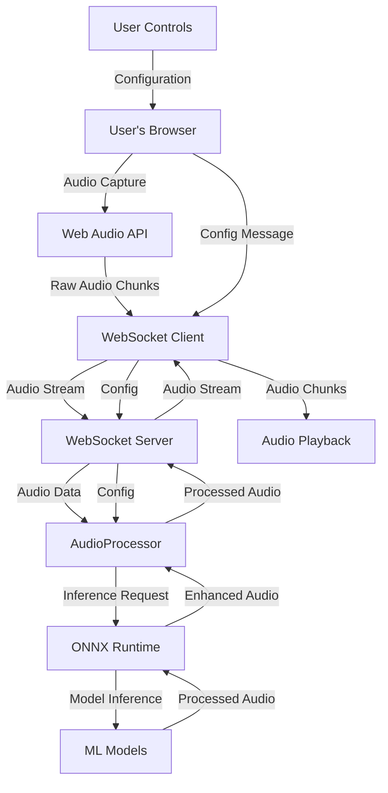
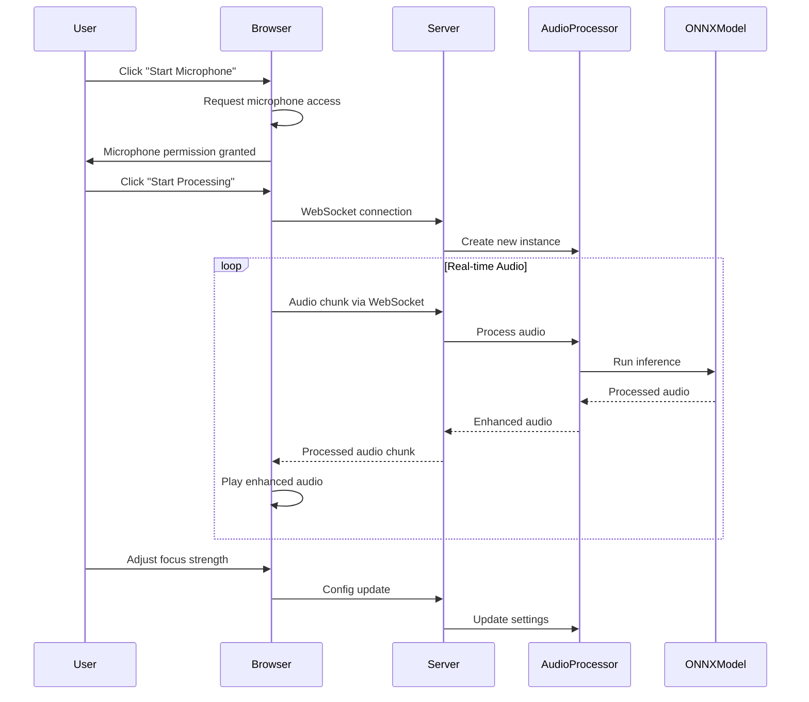

# OpenVox Architecture

## System Overview

OpenVox is a hybrid web application designed for real-time sound isolation and enhancement. It captures audio from the user's microphone, processes it using AI models, and returns the enhanced audio with minimal latency.

## Components

### 1. Client Application (React + TypeScript)

**Location:** `client/`

**Key Features:**
- Audio capture using Web Audio API
- Real-time visualization of audio streams
- WebSocket communication with server
- User interface for source selection and control

**Core Modules:**
- `App.tsx` - Main application component
- Audio capture and processing hooks
- WebSocket client for server communication
- UI components for controls and visualization

### 2. Server Application (Node.js + Fastify)

**Location:** `server/`

**Key Features:**
- WebSocket server for real-time audio streaming
- REST API for configuration and health checks
- ONNX Runtime integration for ML model inference
- Audio processing pipeline

**Core Modules:**
- `index.ts` - Fastify server with WebSocket support
- `audioProcessor.ts` - Audio processing with ONNX models
- Model loading and management

### 3. Audio Processing Pipeline

**Processing Stages:**
1. **Audio Capture** - Client captures microphone audio
2. **Streaming** - Audio chunks sent via WebSocket
3. **Preprocessing** - Normalization, resampling
4. **AI Processing** - Noise suppression, source separation
5. **Postprocessing** - Gain adjustment, focus control
6. **Playback** - Enhanced audio returned to client

## Data Flow

```
┌─────────────┐    Audio Stream    ┌─────────────┐
│   Browser   │ ────────────────── │    Server   │
│  (Client)   │                    │  (Fastify)  │
└─────────────┘                    └─────────────┘
       │                                   │
       ▼                                   ▼
┌─────────────┐                    ┌─────────────┐
│  Web Audio  │                    │  ONNX Model │
│     API     │                    │  Inference  │
└─────────────┘                    └─────────────┘
       │                                   │
       ▼                                   ▼
┌─────────────┐                    ┌─────────────┐
│   Speaker   │ ◀───────────────── │   Processed │
│   Output    │   Enhanced Audio   │    Audio    │
└─────────────┘                    └─────────────┘
```

## WebSocket Protocol

### Message Types

**Client → Server:**
```json
{
  "type": "audio",
  "audioData": [0, 123, -456, ...],
  "timestamp": 1234567890,
  "sampleRate": 44100
}
```

```json
{
  "type": "config",
  "config": {
    "focusStrength": 75,
    "selectedSource": "Voice 1"
  }
}
```

**Server → Client:**
```json
{
  "type": "processed_audio",
  "audioData": [0, 234, -567, ...],
  "processed": true,
  "timestamp": 1234567890
}
```

```json
{
  "type": "config_ack",
  "success": true,
  "config": {...}
}
```

## Audio Models

### Supported Model Types

1. **Noise Suppression**
   - RNNoise ONNX version
   - DeepFeature denoising models

2. **Source Separation**
   - Demucs for music/vocal separation
   - Custom speaker separation models

### Model Integration

Models are loaded using ONNX Runtime Node.js bindings:
```typescript
const session = await InferenceSession.create(modelPath, {
  executionProviders: ['cpu']
});
```

## Performance Considerations

### Latency Targets
- **MVP:** < 300ms end-to-end
- **Optimized:** < 150ms end-to-end
- **Ideal:** < 60ms end-to-end

### Optimization Strategies
1. **Model Quantization** - Use INT8 models for faster inference
2. **Chunk Size Tuning** - Balance between latency and quality
3. **Web Workers** - Offload processing from main thread
4. **Caching** - Reuse model instances across connections

## Security & Privacy

### Data Privacy
- Audio processed on server (or locally if model permits)
- No audio data stored permanently
- WebSocket connections secured with HTTPS in production

### User Consent
- Clear microphone permission requests
- Transparent processing indicators
- Option to disable cloud processing

## Development Environment

### Prerequisites
- Node.js 18+
- npm or yarn
- Modern browser with Web Audio API

### Local Setup
1. Clone repository
2. Install dependencies: `npm install`
3. Start servers: `npm run dev:client` and `npm run dev:server`
4. Access at http://localhost:3000

## Deployment

### Production Build
```bash
npm run build
npm start
```

### Environment Variables
- `PORT` - Server port (default: 4000)
- `HOST` - Server host (default: 0.0.0.0)
- `NODE_ENV` - Environment (development/production)

## Future Enhancements

1. **WebRTC Data Channels** - Lower latency peer-to-peer audio
2. **Mobile PWA** - Progressive Web App capabilities
3. **Multi-microphone Support** - Beamforming with external mics
4. **Speaker Identification** - Voice fingerprinting
5. **Cloud Inference** - Optional heavy model processing

## Architecture Diagrams

### System Data Flow



### Component Interaction



### Audio Processing Pipeline

